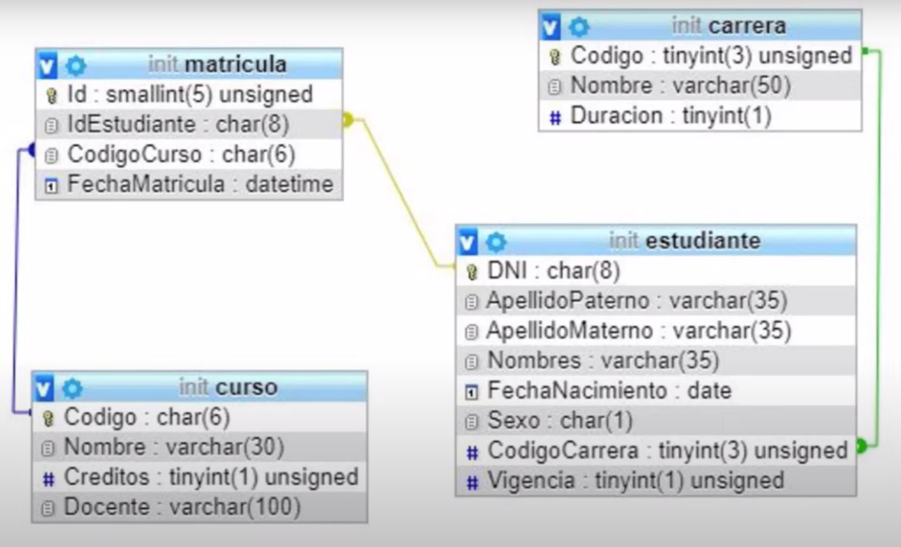

# Proyecto MiUniversidad.
<br></br>
<p align="center">
  
</p>

## Índice.
1. [Descripción del Proyecto](#descripción-del-proyecto)
2. [Arquitectura del Proyecto](#arquitectura-del-proyecto)
3. [Model-View-Template (MVT) en Django](#model-view-template-mvt-en-django)
4. [Tecnologías Utilizadas](#tecnologías-utilizadas)
5. [Proceso ETL](#proceso-etl)
6. [Mejoras Futuras](#mejoras-futuras)
7. [Conclusión](#conclusión)

## 1. Descripción del Proyecto.
El proyecto **MiUniversidad** es una aplicación web desarrollada con Django que gestiona la información de una universidad, incluyendo datos de alumnos, materias y profesores, y mantiene las relaciones entre estos datos mediante claves primarias y foráneas.

## 2. Arquitectura del Proyecto.
El proyecto sigue la estructura típica de Django y se organiza de la siguiente manera:

```plaintext
MiUniversidad/
|-- MiUniversidad/
|   |-- __init__.py
|   |-- asgi.py
|   |-- settings.py
|   |-- urls.py
|   |-- wsgi.py
|-- Modulos/
|   |-- __init__.py
|   |-- Academica/
|       |-- __init__.py
|       |-- admin.py
|       |-- apps.py
|       |-- models.py
|       |-- views.py
|       |-- migrations/
|       |   |-- __init__.py
|       |   |-- 0001_initial.py
|       |-- plantillas/
|           |-- contacto.html
|           |-- formularioContacto.html
|-- manage.py
|-- MiUniversidad.db
└── requirements.txt
```


## 3. Model-View-Template (MVT) en Django.

### Tabla Resumen de MVT.

| Componente | Descripción                                                                                                                                 | Ejemplo en el Proyecto                                   |
|------------|---------------------------------------------------------------------------------------------------------------------------------------------|----------------------------------------------------------|
| Modelo     | Representa las estructuras de datos y define el esquema de la base de datos mediante clases en Django.                                      | Clases `Alumno`, `Materia`, `Profesor` en `models.py`.   |
| Vista      | Contiene la lógica de negocio y controla cómo se muestran los datos al usuario, procesando las solicitudes y devolviendo respuestas.        | Funciones en `views.py` para gestionar vistas y formularios. |
| Plantilla  | Define la estructura y el diseño de las páginas web mediante HTML, utilizando el motor de plantillas de Django para mostrar datos dinámicos. | Archivos HTML en la carpeta `plantillas` (`contacto.html`, `formularioContacto.html`). |

<p align="center">
  
</p>


## 4. Tecnologías Utilizadas.

| Tecnología  | Tipo            | Descripción                                               |
|-------------|-----------------|-----------------------------------------------------------|
| Django      | Framework       | Framework web para Python que sigue la arquitectura MVT   |
| Python      | Lenguaje        | Lenguaje de programación utilizado para el backend        |
| SQLite      | Base de Datos   | Base de datos ligera utilizada para desarrollo            |
| HTML        | Lenguaje        | Lenguaje de marcado para crear las plantillas             |
| Git         | Control de Versión | Sistema para el control de versiones del código fuente  |

<p align="center">
  
</p>

## 5. ETL en el Proyecto.
El proyecto sigue un proceso ETL (Extract, Transform, Load):

| Fase         | Descripción                                                                 |
|--------------|-----------------------------------------------------------------------------|
| Extracción   | Datos extraídos desde formularios de contacto y registros de usuarios       |
| Transformación | Datos transformados mediante funciones y métodos en las vistas             |
| Carga        | Datos cargados en la base de datos SQLite mediante el ORM de Django         |

## 6. Mejoras Futuras.
- **Escalabilidad**: Migrar la base de datos a un sistema más robusto como PostgreSQL.
- **Integración con APIs**: Conectar con APIs externas para obtener datos adicionales.
- **Despliegue en AWS**: Implementar el proyecto en servicios de AWS para mayor disponibilidad.
- **Optimización de Consultas**: Mejorar las consultas a la base de datos para incrementar la eficiencia.

## 7. Conclusión.
Este proyecto demuestra el uso de Django para manejar una base de datos universitaria, destacando la importancia de la arquitectura MVT y los procesos ETL en el desarrollo de aplicaciones web. Con futuras mejoras y la integración de nuevas tecnologías, el proyecto puede escalar y adaptarse a diversas necesidades.


